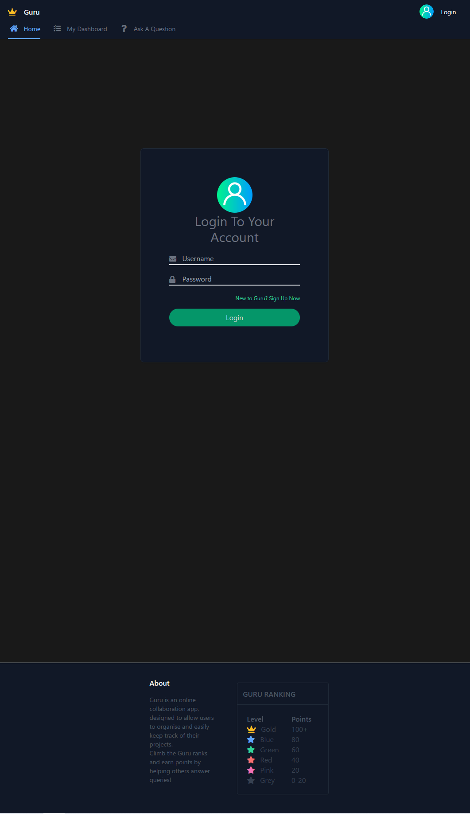
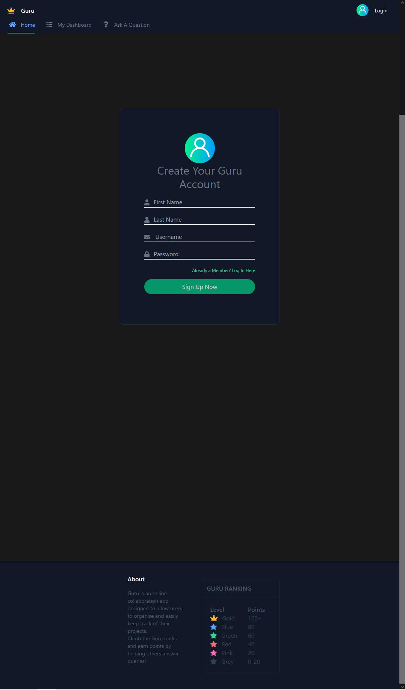
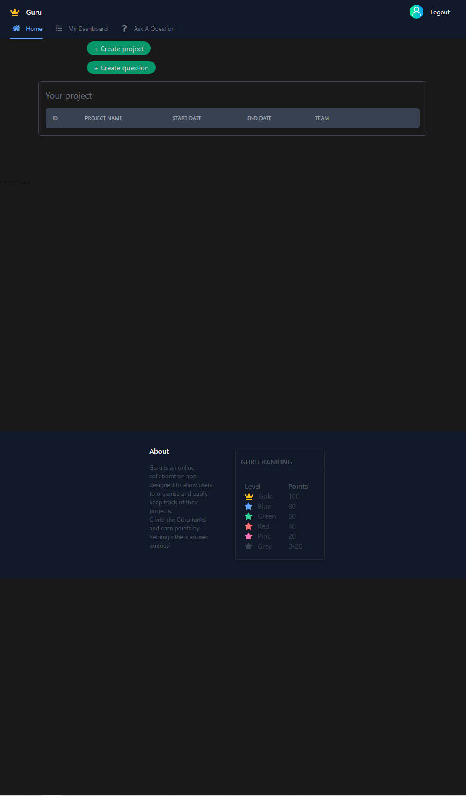

# Guru

## Table of Content: 
* [Deploy link](#Deploy-link)
* [Description](#Description)
* [User Guide](#User-Guide)
* [Screenshot](#Screenshot)
* [Video Demo](#Video-demo)

## Deploy Link
https://guru-heroku-deploy.herokuapp.com/

## Description 
Guru is a PMS (Project Management System) application design for digital team collaboration.

## User Guide
***This guide is for using the Heorku deployed version of Guru.*** 

***If you want to clone the repository and deploy your own version, [Click here](./README_deploy.md) redirect to the self-deployed guide***

```
'/' (http://localhost:3001) This is the homepage for Guru

'/login' (http://localhost:3001/login) This is the login page for Guru

'/signup' (http://localhost:3001/signup) This is the sign up page for Guru

'/dashboard' (http://localhost:3001/dashboard) This page would shows related statistics of an user

'/question' (http://localhost:3001/question) This is where to post questions to get help from other users

'/answer' (http://localhost:3001/answer) This is where you can help out others and potentially upvoted
```

## Screenshot
**Homepage** <br> <br>
**Login Page** <br> <br>

**Sign up page** <br> <br>

**Dashboard page** <br> <br>

**Question page** <br> <br>

**Answer page**  <br> <br>

## Video Demo
<!-- [] -->
