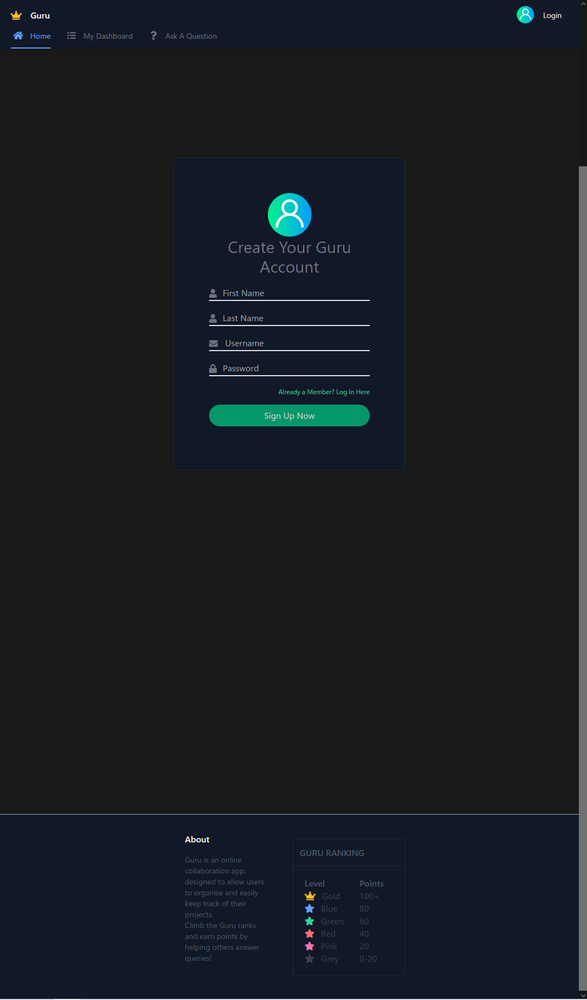

# Guru

## Table of Content:

- [Repository link](#repository-link)
- [Deploy link](#Deploy-link)
- [Description](#Description)
- [Installation](#Installation)
- [Initialization Guide](#Initialization-Guide)
- [User Guide](#User-Guide)
- [Third Party Package](#Third-party-package-used)
- [Screenshot](#Screenshot)
<!-- * [Video Demo](#Video-demo) -->

## Repository Link

https://github.com/AshWeston/PROJECT2

## Deploy Link

https://guru-heroku-deploy.herokuapp.com/

## Description

Guru is a PMS (Project Management System) application design for digital team collaboration.

**_This guide is for self-deployed instance of Guru._**

**_If you want to go back to a already deployed version using Heroku, [Click here](./README.md) redirect to the Heroku-deployed guide_**
<br>

---

## Installation

### This application requires node.js and mysql

**MySQL will be used as the sql management system also known as dialect for the SQL query. Please install node.js before using this application**

**_For information about MySQL : [Installation guide for MySQL](https://dev.mysql.com/doc/refman/8.0/en/installing.html)_** <br> <br>

**_This application also relies on node.js as its run-time enviornment. Please install node.js before using this application_**

**_For information about node.js : [Node.js](https://nodejs.org/)_**

- Clone this project using git clone <url> or Download ZIP, then use a command line to run `npm i` to install necessary packages (inquirer)
  <br>
  <br>

---

## Initialization Guide

**Before using the application, initialization of database and connection is critical**

**MySQL Initialization**

[Installation guide for MySQL](https://dev.mysql.com/doc/refman/8.0/en/installing.html)

`After completion of installing MySQL and creating users, it is essential to initialize the database`

- Visit the subfolder 'db', open up a terminal (commend line interface). Type in

```
mysql -u [replace with username] -p
```

<br>

- Then, enter the password for this user. After that, type in

```
SOURCE schema.sql;
```

`Alternatively, If you start from main folder, type`

```
SOURCE db/schema.sql;
```

- This will create a new SQL database named 'pms_db'. `Beware that Schema.sql will drop (delete) existing database named 'pms_db' before creating a new one, please double-check and backup if you have existing database named using the same name`

- You can rename the database name however you like by changing the 'pms_db' field in `schema.sql` and `.env` file

---

**End goal of MySQL Initialization**

- `the code you require to type is in orange branket` (You can restart at anypoint if you have done a mistake)
  

<br>
<br>

### .env file Initialization

```
The second initialization is .env, .env is used to store your user credential and used to connect to the database by javascript so it is important to do so
```

- Go back to the root folder, you can see a file named `.env.EXAMPLE`

- You can choose any `text(.txt) editor` as program to open the `.env.EXAMPLE` file. Example would be `Notepad` (Included for Windows), `TextEdit` (Included for MacOS) or any Third party one like `Notepad++`

- This file is the format of the env file you would want to create

- You should change the `DB_USER` and `DB_PASSWORD` as the credential you use to login to MySQL

- You can either rename the file as .env or
- create a text file, Copy .env.EXAMPLE and save it new as a .env file
- **.env is the extension name of the file, if the text editor ask you about the extension of the file, leave it or `choose any file type in Notepad`**

---

**End goal of .env Initialization**

## 

---

### seeds file Initialization

If you want to use sample data, type **node seeds/seed.js** as you are initializing the database `or start from scratch`

**End goal of .seeds Initialization**

- `the code you require to type is in orange branket`
  

---

**Initialization is done! You do not have to repeat the steps above unless you are re-deploying or changing user**
<br>
<br>
<br>

## User Guide

User then can type

```
node server.js
```

or

```
npm start / npm begin
```

to run the code.

\***_npm begin is basically the same as npm start. But instead it uses nodemon to run the code_**

- Then, you can access the application by http://localhost:3001 (3001 or other port otherwise specify in .env file)

- Breakpoint or Routes includes:

```
'/' (http://localhost:3001) This is the homepage for Guru

'/login' (http://localhost:3001/login) This is the login page for Guru

'/signup' (http://localhost:3001/signup) This is the sign up page for Guru

'/dashboard' (http://localhost:3001/dashboard) This page would shows related statistics of an user

'/question' (http://localhost:3001/question) This is where to post questions to get help from other users

'/answer' (http://localhost:3001/answer) This is where you can help out others and potentially upvoted
```

## Third party Javascript package used

[Bcrypt](https://github.com/kelektiv/node.bcrypt.js) <br>
[Connect Session Sequelize](https://github.com/mweibel/connect-session-sequelize) <br>
[Dotenv](https://github.com/motdotla/dotenv) <br>
[Express](https://github.com/expressjs/express) <br>
[Express Handlebars](https://github.com/express-handlebars/express-handlebarss) <br>
[MySQL2](https://github.com/sidorares/node-mysql2) <br>
[Nodemon](https://github.com/remy/nodemon.git) <br>
[Sequelize](https://github.com/sequelize/sequelize) <br>

## Screenshot

**Homepage** <br> <br>
**Login Page** <br> <br>

**Sign up page** <br> <br>

**Dashboard page** <br> <br>

**Question page**  <br> <br>

**Answer page**  <br> <br>

<!-- ## Video Demo -->
<!-- [] -->
